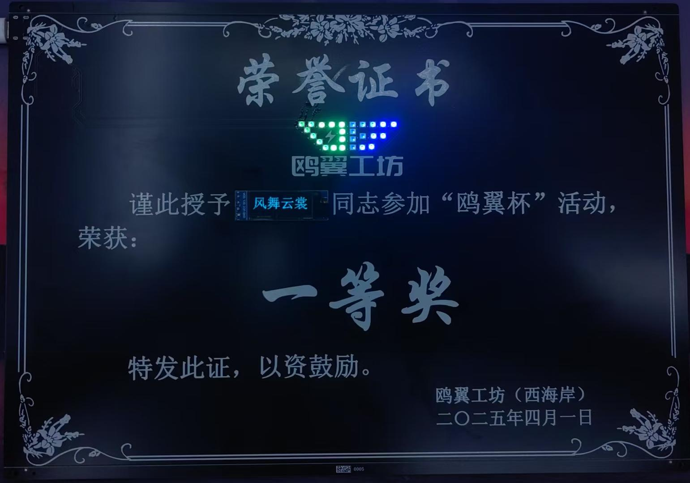

# OE_Cup_PCB_Certificate

   该仓库的最值得注意的是“如何显示32x32大小的汉字”，因为本人在一些网站上找到的都是16x16的汉字显示教程，所以大家可以借鉴本项目中是如何显示32x32汉字的。（当然，大概率网络上已经有该教程，只是本人没有找到。）
  你好！有什么我可以帮助你的吗？
   
   
  - ## 参考链接
  - ### [取汉字字模教程](https://blog.csdn.net/quququuquq/article/details/130226027?fromshare=blogdetail&sharetype=blogdetail&sharerId=130226027&sharerefer=PC&sharesource=qq_34598013&sharefrom=from_link)
  - ### [0.91寸OLED驱动](https://blog.csdn.net/qq_32590891/article/details/137072945?fromshare=blogdetail&sharetype=blogdetail&sharerId=137072945&sharerefer=PC&sharesource=qq_34598013&sharefrom=from_link)
  - ### [WS2812驱动](https://blog.csdn.net/qq_45784265/article/details/142486324?fromshare=blogdetail&sharetype=blogdetail&sharerId=142486324&sharerefer=PC&sharesource=qq_34598013&sharefrom=from_link)
